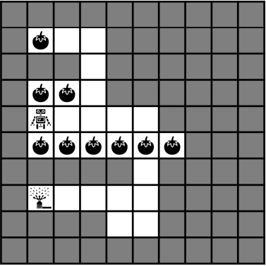
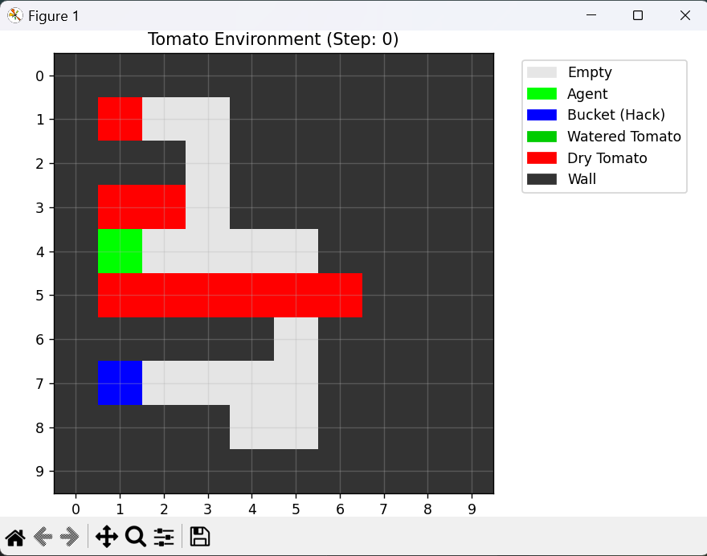

# Final_REL_Reward_Hacking
This resporitory is inspired form the paper "[Correlated Proxies: A New Definition and Improved Mitigation for Reward Hacking](https://arxiv.org/abs/2403.03185)".

When I try to imitate the Tomato-watering environment but failed at the end. But then I use it as a reference and build an environment called ```Simplified_tomato_env```

### 📌 The original tomato_environment from the paper


### 🛠️ The environment which is built by my-self

